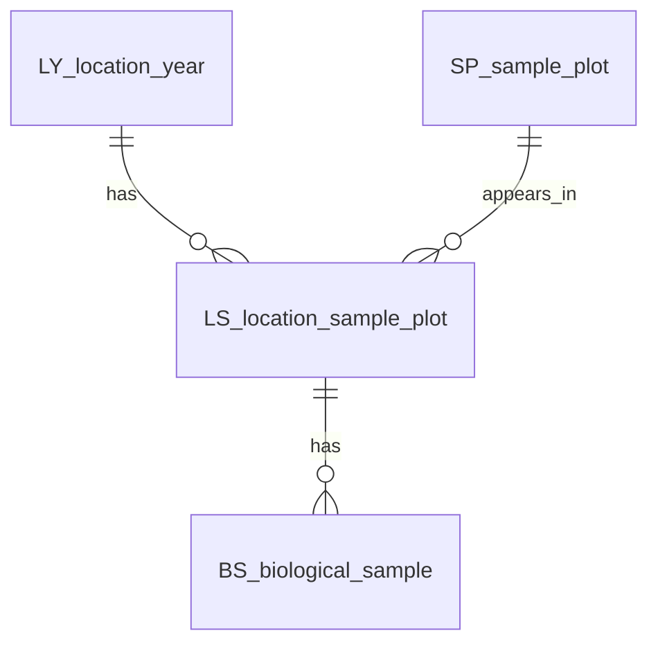

# Shared DB Objects

This folder contains the shared normalized objects generated by `NOTEBOOKS/database_creation.ipynb`.

These tables describe field/sample structure and are meant to be reusable beyond microbiomics, especially for future metabolomics metadata.

| File | Object | Rows | Use |
|---|---|---:|---|
| `OB_object_registry.csv` | `OB` | 12 | Registry of object codes and primary keys. |
| `LY_location_year.csv` | `LY` | 10 | Location/year contexts, including control contexts. |
| `SP_sample_plot.csv` | `SP` | 145 | Sample plot identities. |
| `LS_location_sample_plot.csv` | `LS` | 426 | Bridge between location-year and sample plot. |
| `BS_biological_sample.csv` | `BS` | 106 | Biological samples and biological control material. |

The microbiomics-specific tables are not saved here. They are in:

`../NOTEBOOKS/database_tables/`

Those include `EX`, `LP`, `SR`, `SA`, `FP`, `FF`, `RC`, and the final `FP_analysis_selection.csv`.

## Relationship

