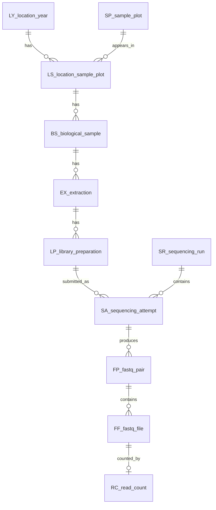

# MICROBIOMICS Metadata

This folder contains the microbiomics metadata workflow and the database-style outputs used to select and describe sequencing data.

The most important analysis-ready table is:

`NOTEBOOKS/database_tables/FP_analysis_selection.csv`

It has one row per physical FASTQ pair and carries inherited metadata from location/year, plot, biological sample, extraction, library preparation, sequencing run, and read counts.

## Main Files

| Path | Meaning |
|---|---|
| `NOTEBOOKS/rename_scripts.ipynb` | Builds and formats the combined source metadata. |
| `NOTEBOOKS/metadata_all.csv` | Flat combined metadata from the source spreadsheets plus rerun metadata. This is mostly an intermediate, not the final analysis table. |
| `NOTEBOOKS/database_creation.ipynb` | Builds the normalized database-style objects and saves the CSV tables. |
| `NOTEBOOKS/database_tables/` | Full microbiomics database output, including sequencing-specific objects. |
| `DB/` | Shared field/sample objects that can also be reused by other data types such as metabolomics. |
| `read_count.csv` | Per-FASTQ-file read counts from the sequencing folders. This replaces the retired `trinucleotide_count_full.csv`. |
| `sequencing_runs_paths_ERDA.csv` | Lookup table for sequencing run folder names and ERDA paths. |
| `EXCEL_FILES/` | Source metadata workbooks and the rerun sample list. |

## Shared DB Objects

The `DB/` folder stores objects that describe the collected plant/sample structure and should not be microbiomics-only:

| Code | Table | Rows | Description |
|---|---:|---:|---|
| `OB` | `OB_object_registry.csv` | 12 | Registry of database object codes. |
| `LY` | `LY_location_year.csv` | 10 | Location/year context, including control contexts. |
| `SP` | `SP_sample_plot.csv` | 145 | Sample plot identities. |
| `LS` | `LS_location_sample_plot.csv` | 426 | Location-year/sample-plot bridge. |
| `BS` | `BS_biological_sample.csv` | 106 | Collected biological sample or biological control material. |

These are the objects that metabolomics can inherit from later. Microbiomics-specific objects such as `EX`, `LP`, `SA`, `FP`, `FF`, and `RC` stay in `NOTEBOOKS/database_tables/`.

## Full Microbiomics Objects

| Code | Table | Rows | Description |
|---|---:|---:|---|
| `OB` | `OB_object_registry` | 12 | Object registry. |
| `LY` | `LY_location_year` | 10 | Location/year context. |
| `SP` | `SP_sample_plot` | 145 | Sample plot identity. |
| `LS` | `LS_location_sample_plot` | 426 | Location-year/sample-plot bridge. |
| `BS` | `BS_biological_sample` | 106 | Biological sample or biological control material. |
| `EX` | `EX_extraction` | 2692 | DNA extraction from a biological sample. |
| `LP` | `LP_library_preparation` | 5373 | Library preparation. |
| `SR` | `SR_sequencing_run` | 20 | Sequencing run folder. |
| `SA` | `SA_sequencing_attempt` | 6525 | One metadata row sent/assigned to a sequencing run. |
| `FP` | `FP_fastq_pair` | 8283 | One physical R1/R2 FASTQ pair. |
| `FF` | `FF_fastq_file` | 16554 | One FASTQ file. |
| `RC` | `RC_read_count` | 17350 | Read count for one FASTQ file. |
| `FP` | `FP_analysis_selection` | 8283 | Final per-FASTQ-pair table for choosing data. |

## Relationship Drawing



## Final Per-FASTQ-Pair Table

Use `NOTEBOOKS/database_tables/FP_analysis_selection.csv` when deciding which microbiomics data to analyze.

Important columns include:

| Column | Meaning |
|---|---|
| `FP_id` | Stable FASTQ-pair identifier. |
| `FP_rowname` | Count-table style identifier: `SR_id/forward_fq`. |
| `FP_forward_path`, `FP_reverse_path` | Relative paths to the physical FASTQ files. |
| `FP_forward_reads`, `FP_reverse_reads`, `FP_pair_reads` | Read counts from `read_count.csv`. |
| `FP_has_read_count` | `True` when both R1 and R2 read counts are present. |
| `FP_include_candidate` | Initial inclusion flag based on read-count availability. |
| `SA_purpose` | `sample`, `seq_control`, `library_control`, or `sample_and_seq_control`. |
| `SA_is_sample` | Dea-style sample flag. |
| `SA_is_seq_control` | Dea-style sequencing-control flag. |
| `SA_is_lib_control` | Dea-style library/control-material flag. |
| `FP_include_control_crushed_amplicon` | `True` when a kept `2022_crushed_amplicon` FASTQ pair also had duplicate `control_crushed_amplicon` metadata. |
| `FP_control_crushed_amplicon_SA_id` | The collapsed control metadata row linked to the kept physical FASTQ pair. |

Current validation summary:

| Check | Count |
|---|---:|
| FASTQ pairs | 8283 |
| FASTQ pairs with both read counts | 8277 |
| FASTQ pairs missing read counts | 6 |
| Duplicate physical R1/R2 pairs | 0 |
| Collapsed `control_crushed_amplicon` duplicates | 48 |

## Sampling Summary

Field location-year/sample-plot contexts are represented by `LS_location_sample_plot`.

| Year | Location | LS plot contexts |
|---:|---|---:|
| 2020 | T | 50 |
| 2021 | T | 144 |
| 2022 | A | 24 |
| 2022 | H | 24 |
| 2022 | L | 24 |
| 2022 | R | 24 |
| 2022 | S | 24 |
| 2023 | T | 110 |
| control | X | 1 |
| control | Z | 1 |

Simple view of field plot contexts:

```text
2020 T |  50 | ############
2021 T | 144 | ####################################
2022 A |  24 | ######
2022 H |  24 | ######
2022 L |  24 | ######
2022 R |  24 | ######
2022 S |  24 | ######
2023 T | 110 | ###########################
```

## Reruns

The rerun samples are retained as additional sequencing attempts, not replacements.

Current rerun runs:

| Sequencing run | Rows |
|---|---:|
| `seq260520_BRLUV` | 359 |
| `seq260612_DR8PG` | 320 |

The reruns are marked with `is_rerun` in `metadata_all.csv` and propagated as `SA_is_rerun` in the database tables.

## Notes

- `metadata_all.csv` is a combined flat source table. It is useful for tracing provenance, but it intentionally repeats sample metadata.
- `FP_analysis_selection.csv` is the preferred table for analysis selection because it is one row per physical FASTQ pair.
- `read_count.csv` is now the read-count source. The old `trinucleotide_count_full.csv` file has been retired.
