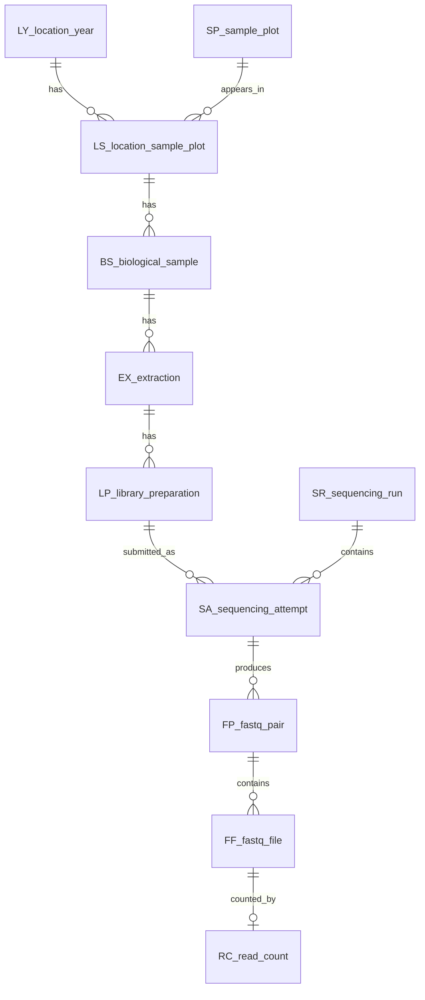

# MICROBIOMICS Metadata

This folder contains the microbiomics metadata workflow and the microbiomics-specific database tables.

The most important analysis-ready table is:

`DB/FP_analysis_selection.csv`

It has one row per physical FASTQ pair and carries inherited metadata from the shared field/sample database plus microbiomics-specific extraction, library preparation, sequencing run, FASTQ, and read-count tables.

## Main Files

| Path | Meaning |
|---|---|
| `NOTEBOOKS/` | Notebook-only folder. The active notebooks are `01_rename_scripts.ipynb` and `02_database_creation.ipynb`. |
| `NOTEBOOKS/01_rename_scripts.ipynb` | Builds and formats the combined source metadata. |
| `metadata_csv/` | Generated flat metadata CSVs from `01_rename_scripts.ipynb`. |
| `metadata_csv/metadata_all.csv` | Flat combined metadata from source spreadsheets plus rerun metadata. This is mostly an intermediate/provenance table. |
| `NOTEBOOKS/02_database_creation.ipynb` | Builds normalized database-style objects and saves CSV tables. |
| `../DB/` | Shared cross-data-type objects: `LY`, `SP`, `LS`, and `BS`. These are intended to be reused by metabolomics. |
| `DB/` | Microbiomics-specific database outputs: `OB`, `EX`, `LP`, `SR`, `SA`, `FP`, `FF`, `RC`, and `FP_analysis_selection`. |
| `TABLES/read_count.csv` | Per-FASTQ-file read counts from the sequencing folders. This replaces the retired `trinucleotide_count_full.csv`. |
| `TABLES/sequencing_runs_paths_ERDA.csv` | Lookup table for sequencing run folder names and ERDA paths. |
| `EXCEL_FILES/` | Source metadata workbooks and the rerun sample list. |

## Shared Root DB Objects

These live in repository-level `../DB/`, not in `MICROBIOMICS/DB/`.

| Code | File | Rows | Description |
|---|---|---:|---|
| `LY` | `../DB/LY_location_year.csv` | 10 | Location/year context, including control contexts. |
| `SP` | `../DB/SP_sample_plot.csv` | 145 | Sample plot identities. |
| `LS` | `../DB/LS_location_sample_plot.csv` | 426 | Location-year/sample-plot bridge. |
| `BS` | `../DB/BS_biological_sample.csv` | 106 | Collected biological sample or biological control material. |

These are the objects metabolomics should inherit from later. The root `../DB/` folder also contains direct lookup inputs such as `LY.csv` and `SP_*.csv` used by formatting notebooks.

## Microbiomics DB Objects

These live in `MICROBIOMICS/DB/`.

| Code | File | Rows | Description |
|---|---|---:|---|
| `OB` | `DB/OB_object_registry.csv` | 12 | Object registry. |
| `EX` | `DB/EX_extraction.csv` | 2692 | DNA extraction from a biological sample. |
| `LP` | `DB/LP_library_preparation.csv` | 5373 | Library preparation. |
| `SR` | `DB/SR_sequencing_run.csv` | 20 | Sequencing run folder. |
| `SA` | `DB/SA_sequencing_attempt.csv` | 6525 | One metadata row sent/assigned to a sequencing run. |
| `FP` | `DB/FP_fastq_pair.csv` | 8283 | One physical R1/R2 FASTQ pair. |
| `FF` | `DB/FF_fastq_file.csv` | 16554 | One FASTQ file. |
| `RC` | `DB/RC_read_count.csv` | 17350 | Read count for one FASTQ file. |
| `FP` | `DB/FP_analysis_selection.csv` | 8283 | Final per-FASTQ-pair table for choosing data. |

## Relationship Drawing



## Final Per-FASTQ-Pair Table

Use `DB/FP_analysis_selection.csv` when deciding which microbiomics data to analyze.

Important columns include:

| Column | Meaning |
|---|---|
| `FP_id` | Stable FASTQ-pair identifier. |
| `FP_rowname` | Count-table style identifier: `SR_id/forward_fq`. |
| `FP_forward_path`, `FP_reverse_path` | Relative paths to the physical FASTQ files. |
| `FP_forward_reads`, `FP_reverse_reads`, `FP_pair_reads` | Read counts from `TABLES/read_count.csv`. |
| `FP_has_read_count` | `True` when both R1 and R2 read counts are present. |
| `FP_include_candidate` | Initial inclusion flag based on read-count availability. |
| `SA_purpose` | `sample`, `seq_control`, `library_control`, or `sample_and_seq_control`. |
| `SA_is_sample` | Dea-style sample flag. |
| `SA_is_seq_control` | Dea-style sequencing-control flag. |
| `SA_is_lib_control` | Dea-style library/control-material flag. |
| `FP_include_control_crushed_amplicon` | `True` when a kept `2022_crushed_amplicon` FASTQ pair also had duplicate `control_crushed_amplicon` metadata. |
| `FP_control_crushed_amplicon_SA_id` | The collapsed control metadata row linked to the kept physical FASTQ pair. |

Current validation summary:

| Check | Count |
|---|---:|
| FASTQ pairs | 8283 |
| FASTQ pairs with both read counts | 8277 |
| FASTQ pairs missing read counts | 6 |
| Duplicate physical R1/R2 pairs | 0 |
| Collapsed `control_crushed_amplicon` duplicates | 48 |

## Sampling Summary

Field location-year/sample-plot contexts are represented by `../DB/LS_location_sample_plot.csv`.

| Year | Location | LS plot contexts |
|---:|---|---:|
| 2020 | T | 50 |
| 2021 | T | 144 |
| 2022 | A | 24 |
| 2022 | H | 24 |
| 2022 | L | 24 |
| 2022 | R | 24 |
| 2022 | S | 24 |
| 2023 | T | 110 |
| control | X | 1 |
| control | Z | 1 |

Simple view of field plot contexts:

```text
2020 T |  50 | ############
2021 T | 144 | ####################################
2022 A |  24 | ######
2022 H |  24 | ######
2022 L |  24 | ######
2022 R |  24 | ######
2022 S |  24 | ######
2023 T | 110 | ###########################
```

## Reruns

The rerun samples are retained as additional sequencing attempts, not replacements.

| Sequencing run | Rows |
|---|---:|
| `seq260520_BRLUV` | 359 |
| `seq260612_DR8PG` | 320 |

The reruns are marked with `is_rerun` in `metadata_csv/metadata_all.csv` and propagated as `SA_is_rerun` in the database tables.

## Notes

- `metadata_csv/metadata_all.csv` is a combined flat source table. It is useful for tracing provenance, but it intentionally repeats sample metadata.
- `DB/FP_analysis_selection.csv` is the preferred table for analysis selection because it is one row per physical FASTQ pair.
- `TABLES/read_count.csv` is now the read-count source. The old `trinucleotide_count_full.csv` file has been retired.
