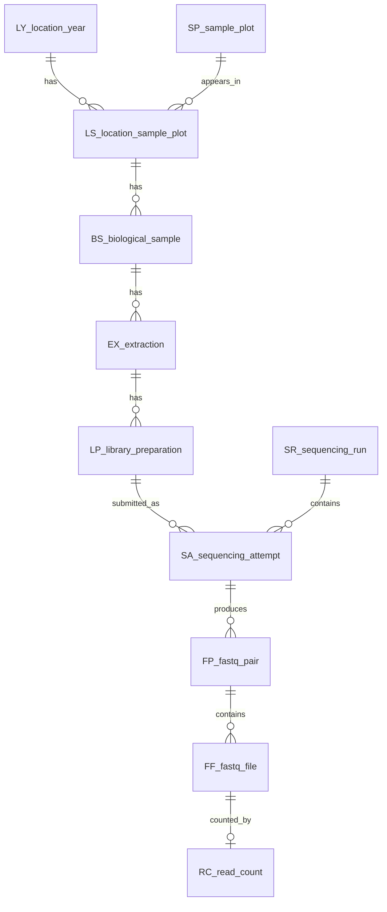

# MATRIX Metadata Repository

This repository stores metadata used to organize MATRIX plant-sample data across data types.

The current active normalized workflow is in `MICROBIOMICS`. The same field/sample concepts will also be useful for metabolomics, because both data types start from collected plant biological samples (`BS`) that belong to location-year/sample-plot contexts (`LY`, `SP`, `LS`).

## Folder Layout

| Path | Purpose |
|---|---|
| `DB/` | Shared cross-data-type database objects and lookup inputs. Files are stored directly in this folder, including `LY.csv`, `SP_*.csv`, and generated `LY`, `SP`, `LS`, `BS` tables after rerunning the notebooks. |
| `MICROBIOMICS/` | Microbiomics metadata, sequencing-run paths, read counts, notebooks, and normalized database outputs. |
| `MICROBIOMICS/TABLES/` | Microbiomics input/reference CSVs such as `read_count.csv` and `sequencing_runs_paths_ERDA.csv`. |
| `MICROBIOMICS/metadata_csv/` | Generated flat metadata CSVs from `rename_scripts.ipynb`, including `metadata_all.csv`. |
| `MICROBIOMICS/DB/` | Microbiomics-specific database outputs, including extraction, library preparation, sequencing, FASTQ, and read-count tables. |
| `METABOLOMICS/` | Placeholder for metabolomics metadata. Future metabolomics tables should reuse the shared `LY`, `SP`, `LS`, and `BS` concepts where possible. |

## Current Data Summary

| Item | Count |
|---|---:|
| Study years | 4 |
| Field locations | 6 |
| Field location-year contexts | 8 |
| Field location-year/sample-plot contexts | 424 |
| Shared biological sample objects (`BS`) | 106 |
| Microbiomics sequencing runs represented in final FP table | 20 |
| Sequencing attempts (`SA`) | 6525 |
| Physical FASTQ pairs (`FP`) | 8283 |
| FASTQ files (`FF`) | 16554 |
| Read-count rows (`RC`) | 17350 |
| FASTQ pairs with both read counts | 8277 |
| FASTQ pairs missing read counts | 6 |

## Sampling Summary

`LS_location_sample_plot` is the best current object for counting plot contexts by year and location.

| Year | Location | LS plot contexts |
|---:|---|---:|
| 2020 | T | 50 |
| 2021 | T | 144 |
| 2022 | A | 24 |
| 2022 | H | 24 |
| 2022 | L | 24 |
| 2022 | R | 24 |
| 2022 | S | 24 |
| 2023 | T | 110 |

Simple plot:

```text
2020 T |  50 | ############
2021 T | 144 | ####################################
2022 A |  24 | ######
2022 H |  24 | ######
2022 L |  24 | ######
2022 R |  24 | ######
2022 S |  24 | ######
2023 T | 110 | ###########################
```

## Database Relationship



## Object Prefixes

All current database objects use two-letter prefixes:

| Prefix | Object | Scope |
|---|---|---|
| `OB` | Object registry | Microbiomics/documentation |
| `LY` | Location-year | Shared |
| `SP` | Sample plot | Shared |
| `LS` | Location-year/sample-plot bridge | Shared |
| `BS` | Biological sample | Shared |
| `EX` | Extraction | Microbiomics for now |
| `LP` | Library preparation | Microbiomics |
| `SR` | Sequencing run | Microbiomics |
| `SA` | Sequencing attempt | Microbiomics |
| `FP` | FASTQ pair | Microbiomics |
| `FF` | FASTQ file | Microbiomics |
| `RC` | Read count | Microbiomics |

## Recommended Rule

Use root `DB/` for shared field/sample objects that other data types should inherit from.

Use `MICROBIOMICS/DB/FP_analysis_selection.csv` when choosing microbiomics sequencing data for analysis.
